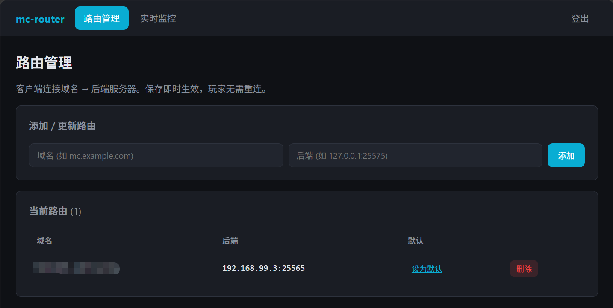

# mc-router 面板

基于 [itzg/mc-router](https://github.com/itzg/mc-router) 的 Minecraft 域名路由方案，附带 Web 管理面板。

## 应用背景

你是否遇到过这样的场景：

- 手上有一台**公网服务器**和一个**域名**，但公网 IP **只有一个**
- Minecraft 默认端口是 `25565`，一台服务器只能开一个"不指定端口"的服
- 你想用**多个子域名**开多台 MC 服务器，玩家连接时不用输端口号（如 `survival.你的域名`、`creative.你的域名`）
- 后端服务器不在公网上，你通过 **异地组网**（[ZeroTier](https://www.zerotier.com/) 或 [Tailscale](https://tailscale.com/)）把家里的机器和公网服务器拉进同一个虚拟内网，实现**内网穿透**

本方案就是为这个场景设计的：**用一个公网 IP + 一个 25565 端口，通过子域名把玩家分流到不同后端服务器**（后端可以是公网机、也可以是异地组网拉进来的内网机）。Web 面板用于管理这些路由配置，并提供实时连接监控。

## 工作原理

mc-router 根据玩家连接时使用的**域名**将流量转发到对应后端服务器（类似 Nginx 虚拟主机）。Web 面板通过 REST API 管理路由配置，并提供实时连接监控。

```
玩家 ──:25565──▶ mc-router ──按域名转发──▶ 后端服务器（公网机 或 异地组网内网机）
浏览器 ──:8080──▶ 面板 ──REST──▶ mc-router 内部 API(:25566，不对外)
```

公网仅暴露 `25565`（游戏）与 `8080`（面板）两个端口。后端服务器无需公网 IP，只要能被 mc-router 访问到即可（同机 / 同 Docker 网络 / 异地组网虚拟内网均可）。

## 面板预览



面板提供路由管理（增删改查域名→后端映射、设置默认后端）与实时监控（在线连接数、各路由流量）。

## 部署

**前置**：Docker 与 Docker Compose v2

```bash
git clone https://github.com/Lei-fly/mc-router-panel.git && cd mc-router-panel
cd docker
cp .env.example .env
# 编辑 .env，设置 PANEL_PASSWORD
docker compose up -d
```

浏览器访问 `http://<服务器IP>:8080`，使用 `.env` 中的密码登录。

### 使用异地组网（ZeroTier / Tailscale）作为后端

若后端 MC 服务器在家里/内网，通过异地组网拉进虚拟内网后，在面板里把后端地址填为该机器的**虚拟内网 IP + 端口**即可（如 `192.168.192.10:25565`）。前提是 mc-router 容器所在宿主机也加入了同一个虚拟网络。

> 面板/mc-router 容器默认走 Docker bridge 网络。要让 mc-router 访问宿主机的异地组网虚拟 IP，可在 `docker-compose.yml` 的 `mc-router` 服务加 `network_mode: host`，或确保 bridge 网络能路由到该虚拟网段。

### 用 Nginx 反向代理为面板配置 HTTPS（推荐）

面板默认走明文 HTTP（`:8080`）。由于面板涉及登录密码，**强烈建议**用 Nginx 反向代理套一层 SSL/TLS，并通过域名访问（避免明文传输密码）。示例：

```nginx
server {
    listen 443 ssl;
    server_name panel.你的域名;

    ssl_certificate     /path/to/fullchain.pem;
    ssl_certificate_key /path/to/privkey.pem;

    location / {
        proxy_pass http://127.0.0.1:8080;
        proxy_set_header Host $host;
        proxy_set_header X-Real-IP $remote_addr;
        proxy_set_header X-Forwarded-For $proxy_add_x_forwarded_for;
        proxy_set_header X-Forwarded-Proto $scheme;
    }
}
```

证书可用 [Let's Encrypt](https://letsencrypt.org/)（[certbot](https://certbot.eff.org/)）免费签发。配置后通过 `https://panel.你的域名` 访问，密码不再明文传输。

## 配置

编辑 `docker/.env`：

| 变量 | 说明 | 默认值 |
|------|------|--------|
| `PANEL_PORT` | 面板端口 | `8080` |
| `PANEL_PASSWORD` | 面板登录密码 | — |
| `ROUTER_PORT` | Minecraft 连接端口 | `25565` |
| `USE_PROXY_PROTOCOL` | PROXY protocol 透传开关 | `false` |

### PROXY protocol

默认关闭。开启后（`USE_PROXY_PROTOCOL=true`）mc-router 会向**所有**后端插入 PROXY v2 头以透传玩家真实 IP，需所有后端同步开启解析，否则玩家无法连接：

- Paper：`config/paper-global.yml` 设 `proxies.proxy-protocol=true`
- Velocity：`velocity.toml` 设 `[advanced] haproxy-protocol=true`
- 单服部署且不需要按 IP 封禁/统计时，保持 `false` 即可

## 目录结构

```
docker/     编排（.env + docker-compose.yml）
panel/      React + Express 面板
  server/   鉴权 + REST 代理 + 指标解析
  src/      登录 / 路由管理 / 实时监控
config/     路由种子配置
data/       运行时数据卷（路由配置、密钥，gitignore）
docs/       文档与截图（UI.png）
.github/    CI（自动构建并发布镜像到 GHCR）
```

## 许可证

MIT。核心组件 [mc-router](https://github.com/itzg/mc-router) 同为 MIT。

## 致谢

- [itzg/mc-router](https://github.com/itzg/mc-router) —— 轻量 Minecraft 连接路由器
- [React](https://react.dev/) / [Express](https://expressjs.com/) / [Vite](https://vitejs.dev/)
